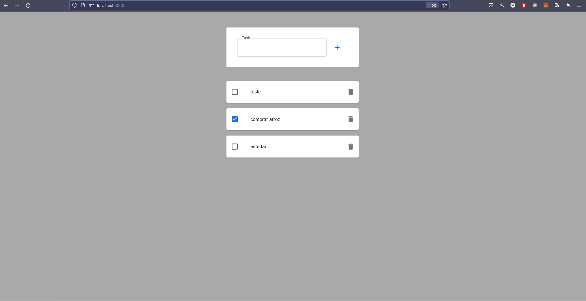

<p align="center">
  
</p>

<br>

## 🧪 Technologies

This project was developed using the following technologies:

- [ReactJS](https://pt-br.reactjs.org/)
- [Vite](https://vitejs.dev/)
- [Material UI](https://mui.com/)

## 🚀 Getting started

Clone the project and access the folder.

```bash
git clone https://github.com/MatheusFC2/todo-list.git

cd todo-list
```

Run this command to install the dependencies.

```bash
yarn install

yarn dev
```

## 🔖 Layout

You can view the project through the links below:

- [Live Preview](https://myonix.vercel.app/)

---

Made with 💜 by [MatheusFC2](https://omatheusfc.vercel.app/) 👋
